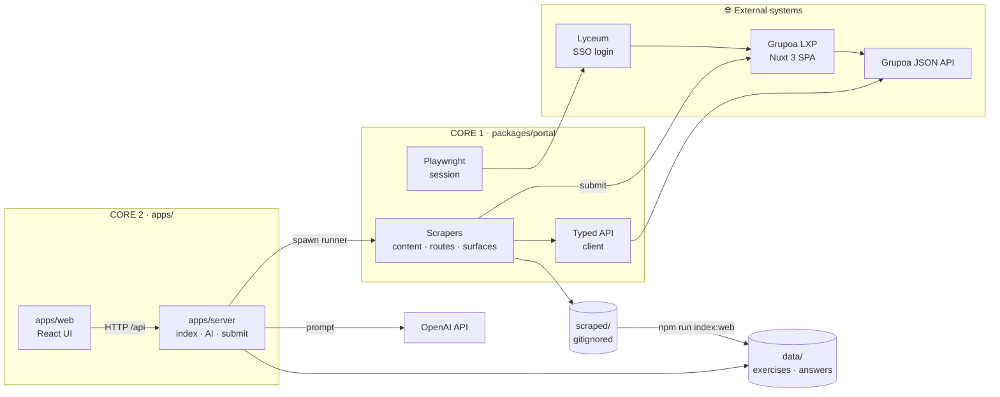
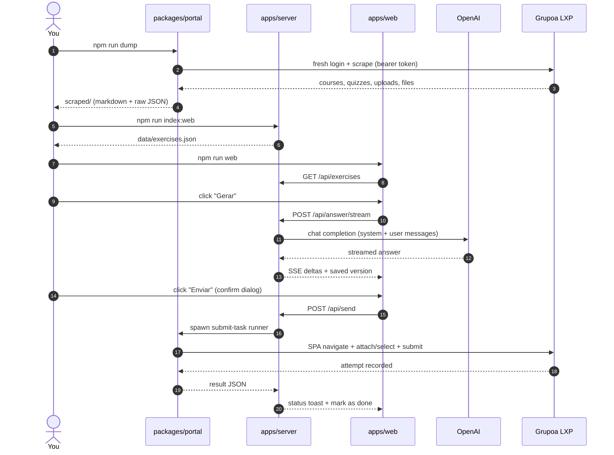

<div align="center">

# 🎓 lxp-toolkit

**Reverse-engineer the UniFOA / Grupoa LXP portal — then turn it into a study & homework assistant.**

A TypeScript monorepo with two cores: a **scraper toolkit** that maps the platform's API and dumps
your course content, and the **LXP Homework** web app that reads it, tracks deadlines, and drafts
answers with AI.


</div>

---

## Table of contents

- [Project at a glance](#project-at-a-glance)
- [Architecture](#architecture)
- [End-to-end pipeline](#end-to-end-pipeline)
- [Repository layout](#repository-layout)
- [Quick start](#quick-start)
- [Command reference](#command-reference)
- [The LXP Homework web app](#the-lxp-homework-web-app)
- [Tech stack](#tech-stack)
- [How it works](#how-it-works)
- [Security & privacy](#security--privacy)
- [Gotchas](#gotchas)
- [Documentation map](#documentation-map)
- [Fair use](#fair-use)

---

## Project at a glance

| | |
|---|---|
| **What** | A personal toolkit for the **UniFOA / Grupoa LXP** learning platform, reached through Lyceum SSO. |
| **Core 1** | `packages/portal` — Playwright login + typed API client that scrapes routes, content, and surfaces to markdown/JSON. |
| **Core 2** | `apps/web` + `apps/server` — the **LXP Homework** web app: task board, deadlines, AI answer drafts, gated submission. |
| **Data** | `scraped/` (your content, gitignored) → `apps/server/data/*.json` (index, answers, submissions). |
| **Runtime** | Node ≥ 22 · TypeScript ESM · npm workspaces · one `npm install`, one lockfile. |
| **Web app** | `npm run web` → <http://localhost:4174> |

> [!NOTE]
> There is no black magic here — a Playwright login plus small scripts that talk to the **same JSON
> API the website uses**. The platform is a Nuxt 3 SPA; the API is the real interface.

---

## Architecture



**The two cores**

| Core | Package | Responsibility |
|---|---|---|
| **Portal toolkit** | `packages/portal` | Authenticates through Lyceum SSO, extracts the single-use LXP bearer token, and drives the JSON API directly to scrape course content, routes, and account surfaces. It also hosts the gated **submit runner** (Playwright) that writes back to the portal. |
| **LXP Homework** | `apps/web` + `apps/server` | Normalizes the scraped tree into an exercise index, serves the React UI, generates pt-BR answer drafts with OpenAI, and bridges submissions to the portal runner. |

**Why it's split this way**

- The scraper owns **all browser + credentials logic**. The web app never sees portal credentials.
- `scraped/` is the clean seam between them: the scraper writes it, the app reads it.
- Writes (quiz answers, file uploads) are the only portal mutations and always go through the
  Playwright runner in `packages/portal` — never a raw `fetch`.

---

## End-to-end pipeline



---

## Repository layout

```
lxp-toolkit/
├── packages/
│   └── portal/                     # CORE 1 — reverse-engineering toolkit
│       ├── src/                    #   auth · session · client · network · content · actions
│       ├── scripts/                #   dump · dump-surfaces · crawl-routes · capture-api · submit-task
│       └── docs/                   #   human reverse-engineering notes (auth, API, topic types, gaps)
│
├── apps/
│   ├── web/                        # CORE 2 — React UI (main product)
│   │   └── src/                    #   pages · components · lib
│   └── server/                     # CORE 2 — Node backend
│       ├── src/                    #   build · view · prompt · ai · send · config
│       ├── server/                 #   HTTP API + static server (port 4174)
│       ├── config/                 #   ai-config.json (committed) · profile/overrides (gitignored)
│       └── data/                   #   exercises.json · answers.json · submissions.json (gitignored)
│
├── agent-docs/                     # distilled knowledge base for AI agents
├── scraped/                        # YOUR scraped content + raw captures (gitignored)
├── package.json                    # workspace root — one install, one lockfile
└── README.md
```

---

## Quick start

> [!IMPORTANT]
> Run every command from the **repository root**. They delegate to the correct workspace.

### 1. Install

```bash
npm install
npx playwright install chromium
```

### 2. Configure

```bash
cp packages/portal/.env.example packages/portal/.env   # portal credentials
cp apps/server/.env.example apps/server/.env           # OpenAI key
```

`packages/portal/.env` — your portal login:

```ini
LXP_USERNAME=seu_ra
LXP_PASSWORD=sua_senha
```

`apps/server/.env` — the AI key (everything else has sensible defaults):

```ini
OPENAI_API_KEY=sk-...
```

### 3. Scrape your content

```bash
npm run dump            # courses, quizzes, uploads + attachments → scraped/
npm run dump-surfaces   # grades, calendar, notices, messages
```

### 4. Run the web app

```bash
npm run index:web       # build the exercise index
npm run web             # build + serve → http://localhost:4174
```

---

## Command reference

### Portal toolkit (`packages/portal`)

| Command | Description |
|---|---|
| `npm run login` | Interactive login → saves a session to `data/storageState.json` (legacy; scripts re-login each run). |
| `npm run dump` | Scrape all course content + download attachments → `scraped/courses/**`, `scraped/raw/content-tree.json`. |
| `npm run dump-surfaces` | Scrape grades, calendar, notices, messages, achievements, communities, LTI → `scraped/*.md`. |
| `npm run crawl-routes` | Crawl SPA routes via client-side navigation → `scraped/routes/**`, `scraped/portal-map.md`. |
| `npm run capture-api` | Record network traffic → `scraped/api-captured.md`, `scraped/raw/api-calls.json`. |
| `npm run agent` | List actionable items; `--read` / `--complete` auto-completes markable content. |
| `npm run index` | Build the offline homework index → `scraped/raw/homework-index.json`. |
| `npm run homework` | Friendly terminal board of open homework, deadline-first. |
| `npm run exercises -- <itemId>` | Print one quiz's questions or an upload's info. |
| `npm run submit-task` | Gated browser runner that submits an answer to the portal (spawned by the server). |

### LXP Homework (`apps/server` + `apps/web`)

| Command | Description |
|---|---|
| `npm run index:web` | Normalize `scraped/` → `apps/server/data/exercises.json`. |
| `npm run web` | Build `apps/web` and serve it via `apps/server` → <http://localhost:4174>. |
| `npm run web:dev` | Vite dev server with hot reload. |

### Workspace

| Command | Description |
|---|---|
| `npm run typecheck` | Type-check every workspace. |
| `npm run build` | Build every workspace. |

---

## The LXP Homework web app

| Area | Highlights |
|---|---|
| **Task board** | Every upload (`Tarefa`) and quiz (`Questionário`) ordered by deadline, with done / expired / due-soon badges and quick actions. |
| **Activity detail** (`/tarefa/:id`) | Instructions, local + remote files (PDFs preview inline), quiz questions, and per-activity AI instructions. |
| **Answer workbench** | Streams the AI draft, keeps a **version history**, and lets you restore any previous version. |
| **Uploads** | Deliver as **direct text**, **`.txt`**, or **`.pdf`** — preview or download the exact artifact before sending. |
| **Quizzes** | The AI returns structured selections (`Q<id>: <letter>`) that map onto the portal's options. |
| **Content refresh** | The **Atualizar** button re-scrapes the portal and rebuilds the list, with live progress. |
| **Profile & AI settings** | Set your name/matrícula and edit the structured writing rules, model, temperature, and token budget. |

See [`apps/server/README.md`](apps/server/README.md) for the full feature tour.

---

## Tech stack

| Layer | Tools |
|---|---|
| **Language** | TypeScript (ESM, NodeNext) on Node ≥ 22 |
| **Monorepo** | npm workspaces (`apps/*`, `packages/*`) |
| **Scraping** | Playwright, `node-html-markdown`, `zod`, `pino` |
| **Backend** | Node `http`, OpenAI SDK, `pdf-parse`, LibreOffice (optional, for `.pdf` artifacts) |
| **Frontend** | React 18, Vite 5, Tailwind v4, shadcn / Base UI, lucide-react, react-router, sonner |
| **Runtime** | `tsx` (no build step for scripts) |

---

## How it works

### Portal toolkit

1. **Authenticate** — Playwright logs into `unifoa.lyceum.com.br`, follows the SSO exchange, and
   reads `plataforma_accessToken` from `localStorage`. The token is **single-use / single-page
   session**, so every run logs in fresh.
2. **Drive the API** — a typed `ApiClient` calls `api.plataforma.grupoa.education` with the exact
   headers the SPA uses (retry/backoff included).
3. **Scrape & classify** — the content tree is walked, every topic is classified by `topicTypeId`
   (reading, quiz, file upload, link, …), HTML is converted to markdown, and attachments are
   downloaded.
4. **Submit (gated)** — writes go through a real browser: `submit-task.ts` navigates via
   `$nuxt.$router.push()`, fills/selects, and confirms.

### Assistant

1. **Index** — `build.ts` turns `scraped/raw/content-tree.json` into `data/exercises.json`,
   computing `status` (`open` / `expired` / `done`) and `daysLeft`.
2. **Compose** — `prompt.ts` builds two messages: a `system` message from structured `style` rules
   and a `user` message with the selected activity content. No `===` markers are sent, so the model
   has nothing to echo.
3. **Generate** — `ai.ts` streams a pt-BR draft from OpenAI and saves it as a new version in
   `data/answers.json`.
4. **Submit** — `send.ts` writes a request JSON and spawns the portal runner, then records the
   outcome in `data/submissions.json`.

---

## Security & privacy

- 🔒 `scraped/` holds **your account's data** and is gitignored. Each user generates their own.
- 🔑 Credentials live only in `packages/portal/.env`; the OpenAI key only in `apps/server/.env`.
  Both are gitignored — never commit them.
- 🧼 Logs redact passwords, tokens, and `authorization` headers (`pino` redaction).
- 🌐 The web app **never** receives portal credentials. Submissions are spawned server-side.
- ✋ Nothing is ever auto-submitted: every write requires an explicit confirmation dialog.

---

## Gotchas

- 🔑 **Single-use token** — the login token dies on a full page reload. Navigate the SPA with
  `$nuxt.$router.push()`, never `page.goto`.
- 🐢 **Keep request volume low** — repeated logins can trip rate-limits or a reCAPTCHA.
- 🧩 **`tsx` + `page.evaluate`** throws `__name is not defined`; `createSession()` injects a shim
  automatically.
- 🛡️ **AWS WAF** fronts the API — GET reads work with the bearer token; POST/PUT may need a real
  browser to solve the challenge.
- 📄 **Upload formats** — the portal's uploader accepts `txt`/`pdf`/Office/archives but **not**
  `.md`; the app converts drafts to `.txt` or `.pdf` for you.

---

## Documentation map

| Doc | Contents |
|---|---|
| [`packages/portal/docs/README.md`](packages/portal/docs/README.md) | Reverse-engineering index. |
| [`packages/portal/docs/auth.md`](packages/portal/docs/auth.md) | SSO flow, token lifecycle, headers. |
| [`packages/portal/docs/api-endpoints.md`](packages/portal/docs/api-endpoints.md) | Every discovered endpoint. |
| [`packages/portal/docs/topic-types.md`](packages/portal/docs/topic-types.md) | `topicTypeId` → content kind mapping. |
| [`packages/portal/docs/gaps.md`](packages/portal/docs/gaps.md) | Write-side gap analysis. |
| [`apps/server/README.md`](apps/server/README.md) | The web app's full feature tour. |
| [`apps/server/docs/ARQUITETURA.md`](apps/server/docs/ARQUITETURA.md) | How the app's pieces connect. |
| [`agent-docs/00-INDEX.md`](agent-docs/00-INDEX.md) | Distilled knowledge base for AI agents. |

---

## Fair use

This toolkit reads **your own** academic data for studying. Know what your institution allows, and
don't use it to fake completion of coursework. Auto-submitting is gated behind explicit
confirmation for exactly this reason — the student stands behind what they send.
