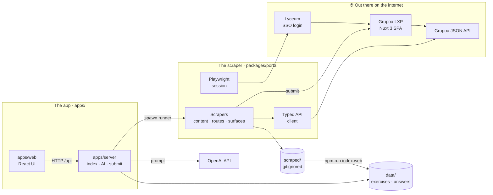
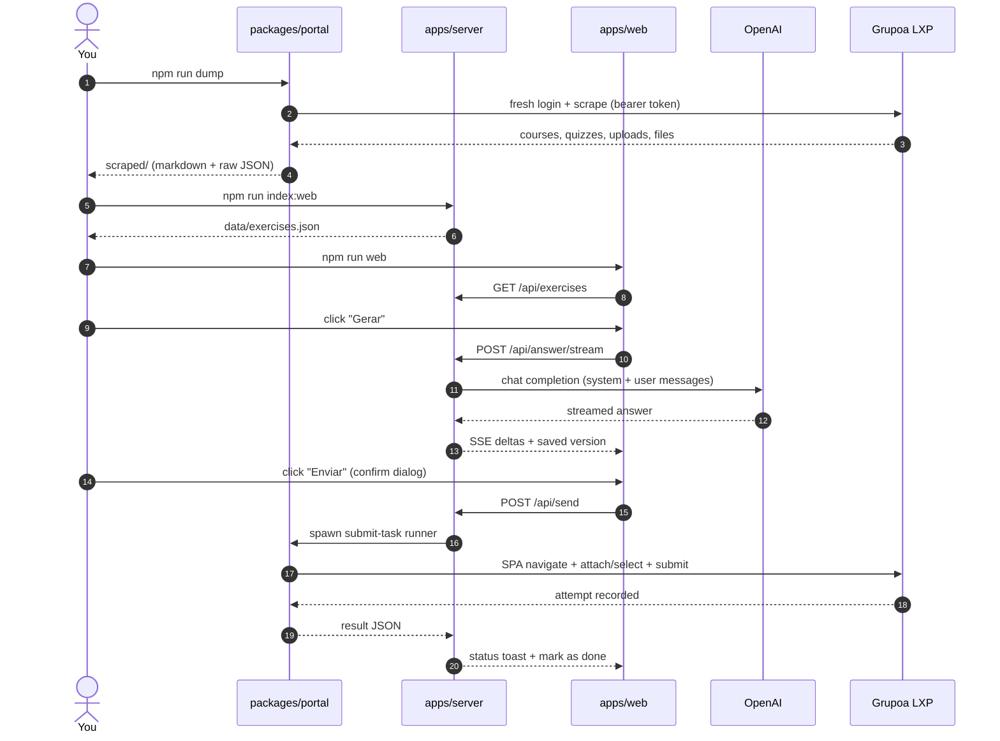

<div align="center">

# 🎓 lxp-toolkit

**It scrapes your UniFOA / Grupoa LXP portal, then turns it into a homework assistant.**

A little TypeScript monorepo with two halves: a **scraper** that maps the platform's API and saves
all your course stuff as markdown, and **Pauta** — a web app that reads it, watches your
deadlines, and drafts answers with AI.


</div>

---

## What's in the box?

Honestly? Two things that go together:

- 🕷️ **The scraper** (`packages/portal`) — logs in as you, pokes the same JSON API the site uses,
  and dumps every reading, quiz, and assignment to nice readable markdown. It also has the browser
  bot that actually submits stuff.
- 🎓 **Pauta** (`apps/web` + `apps/server`) — the web app. It reads what the scraper saved,
  shows you what's due, and helps you write the answer.

> [!NOTE]
> No sketchy magic, promise. It's a Playwright login plus a bunch of small scripts talking to the
> exact same API the website calls. The site is a Nuxt 3 app; the API is the real deal.

## Table of contents

- [The two halves](#the-two-halves)
- [How it all fits together](#how-it-all-fits-together)
- [The whole flow, start to finish](#the-whole-flow-start-to-finish)
- [What lives where](#what-lives-where)
- [Getting it running](#getting-it-running)
- [All the commands](#all-the-commands)
- [The Pauta app](#the-pauta-app)
- [What it's built with](#what-its-built-with)
- [How it actually works](#how-it-actually-works)
- [Staying safe (and private)](#staying-safe-and-private)
- [Things that will bite you](#things-that-will-bite-you)
- [Where to read more](#where-to-read-more)
- [Be cool about it](#be-cool-about-it)

---

## The two halves

| | |
|---|---|
| **The scraper** | `packages/portal` — Playwright login + a typed API client. Scrapes routes, content, and account surfaces into markdown/JSON. |
| **The app** | `apps/web` + `apps/server` — **Pauta**: task board, deadlines, AI answer drafts, and (careful) submission. |
| **The data** | `scraped/` (your stuff, gitignored) → `apps/server/data/*.json` (index, answers, submissions). |
| **Runs on** | Node ≥ 22 · TypeScript ESM · npm workspaces · one `npm install`, one lockfile. |
| **Open it at** | `npm run web` → <http://localhost:4174> |

---

## How it all fits together



**Why two halves and not one big thing?** Mostly so the credentials stay in one place:

- The scraper is the only part that touches a browser and your portal password.
- The web app never, ever sees your portal login.
- `scraped/` is the handoff: the scraper writes it, the app reads it.
- The only time we *write* to the portal (answering a quiz, uploading a file) it goes through the
  Playwright runner in `packages/portal` — never a raw `fetch`.

---

## The whole flow, start to finish



---

## What lives where

```
lxp-toolkit/
├── packages/
│   └── portal/                     # the scraper
│       ├── src/                    #   auth · session · client · network · content · actions
│       ├── scripts/                #   dump · dump-surfaces · crawl-routes · capture-api · submit-task
│       └── docs/                   #   the reverse-engineering notes
│
├── apps/
│   ├── web/                        # the React UI (the fun part)
│   │   └── src/                    #   pages · components · lib
│   └── server/                     # the backend
│       ├── src/                    #   build · view · prompt · ai · send · config
│       ├── server/                 #   HTTP API + static server (port 4174)
│       ├── config/                 #   ai-config.json (committed) · profile/overrides (gitignored)
│       └── data/                   #   exercises.json · answers.json · submissions.json (gitignored)
│
├── agent-docs/                     # notes for AI agents working on this repo
├── scraped/                        # YOUR scraped content + raw captures (gitignored)
├── package.json                    # workspace root — one install, one lockfile
└── README.md
```

---

## Getting it running

> [!IMPORTANT]
> Run everything from the **repo root**. The commands know where to go from there.

### 1. Install the stuff

```bash
npm install
npx playwright install chromium
```

### 2. Add your secrets

```bash
cp packages/portal/.env.example packages/portal/.env   # your portal login
cp apps/server/.env.example apps/server/.env           # your OpenAI key
```

In `packages/portal/.env`:

```ini
LXP_USERNAME=seu_ra
LXP_PASSWORD=sua_senha
```

In `apps/server/.env` — just the key, everything else already has good defaults:

```ini
OPENAI_API_KEY=sk-...
```

### 3. Grab your content

```bash
npm run dump            # courses, quizzes, uploads + attachments → scraped/
npm run dump-surfaces   # grades, calendar, notices, messages
```

### 4. Fire up the app

```bash
npm run index:web       # build the exercise index
npm run web             # build + serve → http://localhost:4174
```

---

## All the commands

### The scraper (`packages/portal`)

| Command | What it does |
|---|---|
| `npm run login` | Logs in interactively → `data/storageState.json` (legacy — scripts re-login anyway). |
| `npm run dump` | Scrapes all course content + downloads attachments → `scraped/courses/**`. |
| `npm run dump-surfaces` | Grades, calendar, notices, messages, achievements, communities, LTI → `scraped/*.md`. |
| `npm run crawl-routes` | Crawls SPA routes via client-side nav → `scraped/routes/**`. |
| `npm run capture-api` | Records network traffic → `scraped/api-captured.md`. |
| `npm run agent` | Lists actionable items; `--read` / `--complete` auto-marks the markable ones. |
| `npm run index` | Builds the offline homework index → `scraped/raw/homework-index.json`. |
| `npm run homework` | A terminal board of what's due, deadline-first. |
| `npm run exercises -- <itemId>` | Prints one quiz's questions or an upload's info. |
| `npm run submit-task` | The gated browser bot that submits to the portal (the server spawns it). |

### The app (`apps/server` + `apps/web`)

| Command | What it does |
|---|---|
| `npm run index:web` | Turns `scraped/` into `apps/server/data/exercises.json`. |
| `npm run web` | Builds the UI and serves it → <http://localhost:4174>. |
| `npm run web:dev` | Vite dev server with hot reload. |

### Handy ones

| Command | What it does |
|---|---|
| `npm run typecheck` | Type-checks everything. |
| `npm run build` | Builds everything. |

---

## The Pauta app

| Bit | What's cool about it |
|---|---|
| **Task board** | Every `Tarefa` and `Questionário` sorted by deadline, with done / expired / due-soon badges. |
| **Activity page** (`/tarefa/:id`) | Instructions, files (PDFs preview right there), quiz questions, and per-activity AI notes. |
| **Answer workbench** | Streams the draft, keeps a **version history**, lets you restore any old version. |
| **Uploads** | Send as **text**, **`.txt`**, or **`.pdf`** — and preview/download the exact file first. |
| **Quizzes** | The AI answers in `Q<id>: <letter>` and it maps onto the portal's options. |
| **Atualizar** | Re-scrapes the portal and rebuilds the list, with live progress. |
| **Profile & settings** | Your name/matrícula, the writing rules, model, temperature, token budget. |

Want the long version? It's in [`apps/server/README.md`](apps/server/README.md).

---

## What it's built with

| Layer | Tools |
|---|---|
| **Language** | TypeScript (ESM, NodeNext) on Node ≥ 22 |
| **Monorepo** | npm workspaces (`apps/*`, `packages/*`) |
| **Scraping** | Playwright, `node-html-markdown`, `zod`, `pino` |
| **Backend** | Node `http`, OpenAI SDK, `pdf-parse`, LibreOffice (optional, for `.pdf`) |
| **Frontend** | React 18, Vite 5, Tailwind v4, shadcn / Base UI, lucide-react, react-router, sonner |
| **Runner** | `tsx` (no build step for scripts) |

---

## How it actually works

### The scraper

1. **Log in** — Playwright signs into `unifoa.lyceum.com.br`, follows the SSO dance, and grabs
   `plataforma_accessToken` from `localStorage`. That token is **single-use / one page session**, so
   every run logs in fresh. Yes, every time. That's normal.
2. **Talk to the API** — a typed `ApiClient` calls `api.plataforma.grupoa.education` with the exact
   headers the site uses (with retry/backoff so we don't get yelled at).
3. **Scrape & sort it out** — walks the content tree, classifies each topic by `topicTypeId`
   (reading, quiz, upload, link…), converts the HTML to markdown, and downloads the attachments.
4. **Submit (carefully)** — writes go through a real browser: `submit-task.ts` navigates with
   `$nuxt.$router.push()`, fills or selects the right thing, and confirms.

### The app

1. **Index** — `build.ts` turns `scraped/raw/content-tree.json` into `data/exercises.json`, working
   out `status` (`open` / `expired` / `done`) and `daysLeft`.
2. **Compose** — `prompt.ts` builds two messages: a `system` one from the structured `style` rules,
   and a `user` one with just the activity content. No `===` markers get sent, so the model has
   nothing to parrot back.
3. **Generate** — `ai.ts` streams a pt-BR draft from OpenAI and saves it as a new version in
   `data/answers.json`.
4. **Send** — `send.ts` writes a request file, spawns the portal runner, and logs the result in
   `data/submissions.json`.

---

## Staying safe (and private)

- 🔒 `scraped/` is **your account's data** and it's gitignored. Everyone generates their own.
- 🔑 Credentials live only in `packages/portal/.env`; the OpenAI key only in `apps/server/.env`.
  Both gitignored. Don't commit them. Ever.
- 🧼 Logs redact passwords, tokens, and `authorization` headers.
- 🌐 The web app **never** gets your portal credentials — submissions are spawned server-side.
- ✋ Nothing auto-submits. Every write needs you to click confirm.

---

## Things that will bite you

- 🔑 **The token is single-use.** A full page reload kills it. Navigate with
  `$nuxt.$router.push()`, never `page.goto`.
- 🐢 **Take it easy.** Repeated logins can trip rate-limits or a reCAPTCHA.
- 🧩 **`tsx` + `page.evaluate`** throws `__name is not defined`; `createSession()` patches that for
  you.
- 🛡️ **AWS WAF** guards the API. GET reads are fine with the token; POST/PUT may need a real browser.
- 📄 **Upload formats:** the portal takes `txt`/`pdf`/Office/archives but **not** `.md`. The app
  converts drafts to `.txt` or `.pdf` so you don't have to think about it.

---

## Where to read more

| Doc | What's in it |
|---|---|
| [`packages/portal/docs/README.md`](packages/portal/docs/README.md) | The reverse-engineering index. |
| [`packages/portal/docs/auth.md`](packages/portal/docs/auth.md) | SSO flow, token lifecycle, headers. |
| [`packages/portal/docs/api-endpoints.md`](packages/portal/docs/api-endpoints.md) | Every endpoint we found. |
| [`packages/portal/docs/topic-types.md`](packages/portal/docs/topic-types.md) | `topicTypeId` → content kind. |
| [`packages/portal/docs/gaps.md`](packages/portal/docs/gaps.md) | What's still unknown on the write side. |
| [`apps/server/README.md`](apps/server/README.md) | The app's full feature tour. |
| [`apps/server/docs/ARQUITETURA.md`](apps/server/docs/ARQUITETURA.md) | How the app's pieces connect. |
| [`agent-docs/00-INDEX.md`](agent-docs/00-INDEX.md) | Notes for AI agents working here. |

---

## Be cool about it

This thing reads **your own** academic data, for studying. Know what your school allows, and don't
use it to fake your way through coursework. That's exactly why submitting is locked behind a
confirmation dialog — you're the one standing behind what goes in.
